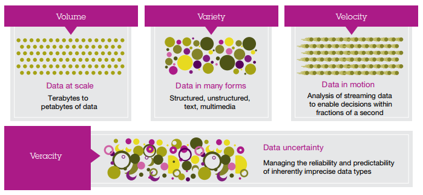
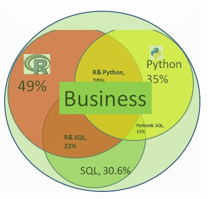
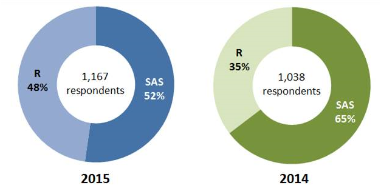
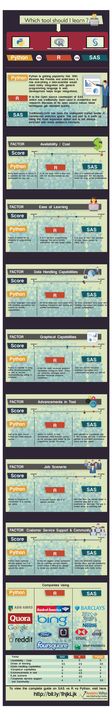

# Data Science

## Big Data

### Introduction

> Big data allows a more complete picture of customers' preferences and demands; through this deeper understanding, organizations of all types are finding new ways to engage with existing and potential customers.

### Dimensions of Big Data

- Volume: The amount of data
- Variety: Different types of data and data sources
- Velocity: The speed at which data is created, processed and analyzed
- Veracity: Reliability associated with certain types of data

Image from _Analytics: The real-world use of big data_ by _IBM Institute for Business Value_

### Tools Summary

- [Hadoop](#hadoop)
- Pig
- Hive
- Spark
- Flume
- Scribe
- Storm
- Chukwa
- Splunk
- Rainbird
- Tableau (BI)
- Spotfire (BI)
- QlikView (BI)
- Power BI (BI)
- Databricks (Spark Implementation)
- Talend (ETL)
- IBM Datastage (ETL)
- Informatica (ETL)
- MongoDB (NoSQL)
- CouchDB (NoSQL)
- Netezza 
- Greenplum

### Articles

- [http://www.zdnet.com/article/m2m-makes-sense-for-dbs-bank/](http://www.zdnet.com/article/m2m-makes-sense-for-dbs-bank/)

## Hadoop 

__Hadoop should be used for__

- Business Statistic Reports
- Generating aggregated valuable information out of big volumes of data
- Unstructured data
- Long-term analysis
- Social network analysis
- Ticketing systems analysis
- Financial behavior predictions based on pattern recognition

__Hadoop should NOT be used for__

- Less considerable volumes of data
- Structured data
- Data which frequently changes
- Transactional data

## Programming Languages for Statistics

__R, Python, SQL and BUSINESS__

[Source](http://www.kdnuggets.com/2015/09/one-language-data-scientist-must-master.html)

__R vs Python__

[Source 1](http://blog.datacamp.com/r-or-python-for-data-analysis/) [Source 2](http://www.kdnuggets.com/2015/05/r-vs-python-data-science.html)

__R vs SAS__

[Source (funny quotes)](http://www.burtchworks.com/2015/05/21/2015-sas-vs-r-survey-results/)

__Python vs R vs SAS__

[Source](http://www.analyticsvidhya.com/blog/2015/05/infographic-quick-guide-sas-python/)

### Python

__Popular packages__

- NumPy / SciPy for scientific computing
- pandas for data manipulation
- matplotlib to make graphics
- scikit-learn for machine learning
- Seaborn, Bokeh and Pygal to visualize data
- statsmodels to explore data, estimate statistical models, and perfom statistical tests and unit tests
- UnitTest, Nose, DocTest and Pytest for testing

__IDEs__

- Spyder
- [IPython Notebook](http://blog.jetbrains.com/pycharm/2014/12/feature-spotlight-ipython-notebook-inside-an-ide/)
- Rodeo

### R

__Popular packages__

- dplyr, plyr and data.table to easily manipulate packages
- stringr to manipulate strings
- zoo to work with regular and irregular time series
- ggvis, lattice, ggplot2, GGally, googleVis and rCharts to visualize data
- caret for machine learning
- pqR, renjin and FastR, Riposte, RevoScaleR and Foreach to improve R’s performance 
- Rcpp
- digest
- reshape2
- RColorBrewer
- labeling
- colorspace
- scales

__Commands__

- available.packages()
  - listing CRAN available packages
- install.packages( "package" )
- install.packages( c("package1","package2") )
  - installing packages
- library( "package" )
- search()
  - including packages
- find.package( "package" )
  - verify installation package
- find_rtools()
  - Rtools

__Distributed Computing Engines__

- H2O
- ScaleR
- Skytree

__Documentation__

- Rdocumentaion

### SAS

__Data Structures__

- Datasets (Tables)
- Variables (Columns)
- Observations (Rows)

__Procedures__

- AKA "Procs"
- in-built commands used to manipulate data in a particular way (e.g. PROC SORT)

__Commands__

- data
- infile
- filename
- input 
  - Add $ sign after the variable name for characters values
- length "variable_name" "lenght digit" (e.g. length country $20.;)
  - Default length for variables is 8
- informat "variable_name" "format" (e.g. informat race_date mmddyy8.;)
  - To set the proper format of a variable
- format "variable_name" "format" (e.g. format race_date mmddyy8.;)
  - To display the variable in a specific date format
  - SAS store dates as number of days from Jan 1 1960 
  - Numeric data is right aligned
  - Character data is left aligned
- proc (e.g. proc import datafile='D:\data.csv')
  - proc command read 20 first observations to infer variables types, this could be change (GUESSINGROWS)
  - Tip: run proc command, copy log output and paste it back to code window to use infile style
- run
- * (comment)
- libname
  To define permanent libraries
- set
- if

__Importing data__

- INFILE / INPUT
- PROC IMPORT
- GUI

__Exporting data__

- FILE / PUT
- PROC EXPORT
- GUI

__Tips__

Keys things when importing data into SAS

- Provide details about external raw data source including:
  - Type
  - Location
  - Variables 
  - Variables formats
  - Variables length
- Avoid inadvertent loss of data when importing (e.g. string length, dates format)
- Review the log for errors
- Check output dataset to make sure import has worked properly
- Datasets are stored in libraries. Default library is 'Work'. Max length of libraries names is 8
- Datasets by default are Temporary datasets, when close the SAS session all datasets will be lost

#### Articles

- [http://www.kdnuggets.com/2015/10/r-vs-python-data-analysis.html](http://www.kdnuggets.com/2015/10/r-vs-python-data-analysis.html)
- [http://www.r-bloggers.com/sas-vs-r-the-right-answer-to-the-wrong-question/](http://www.r-bloggers.com/sas-vs-r-the-right-answer-to-the-wrong-question/)
- [http://www.kdnuggets.com/2015/05/r-vs-python-data-science.html](http://www.kdnuggets.com/2015/05/r-vs-python-data-- science.html)

## Quotes

> Data Science exists to provide a service to business, and business is run by people